---
## Front matter
lang: ru-RU
title: Лабораторная работа №1
subtitle: Настройка рабочего окружения
author:
  - Ильин А.В.
institute:
  - Российский университет дружбы народов, Москва, Россия
date: 9 сентября 2023

## i18n babel
babel-lang: russian
babel-otherlangs: english

## Fonts
mainfont: PT Serif
romanfont: PT Serif
sansfont: PT Sans
monofont: PT Mono
mainfontoptions: Ligatures=TeX
romanfontoptions: Ligatures=TeX
sansfontoptions: Ligatures=TeX,Scale=MatchLowercase
monofontoptions: Scale=MatchLowercase,Scale=0.9

## Formatting pdf
toc: false
toc-title: Содержание
slide_level: 2
aspectratio: 169
section-titles: true
theme: metropolis
header-includes:
  - \metroset{progressbar=frametitle,sectionpage=progressbar,numbering=fraction}
  - '\makeatletter'
  - '\beamer@ignorenonframefalse'
  - '\makeatother'
---

# Информация

## Докладчик

:::::::::::::: {.columns align=center}
::: {.column width="70%"}

- Ильин Андрей Владимирович
- НФИбд-01-20
- 1032201656
- Российский Университет Дружбы Народов
- [1032201656@pfur.ru](mailto:1032201656@pfur.ru)
- <https://github.com/av-ilin>

:::
::: {.column width="30%"}

:::
::::::::::::::

# Вводная часть

## Актуальность

- Приобрести необхдимые в современном научном сообществе навыки администрирования систем и информационной безопасности.

## Цель

- Целью данной работы является приобретение практических навыков установки операционной системы на виртуальную машину, настройки минимально необходимых для дальнейшей работы сервисов.

## Задачи

1. Установить дистрибутив Linux на базе RedHat: установить операционную систему Rocky на виртуальную машину, используя средства VirtualBox.

2. Настроить систему контроля версий - Git: создать репозиторий дисциплины, связать с локальной машиной, проинициализировать начальными значениями (добавить changelog, readme, gitignore, license).

## Материалы и методы

- Rocky Linux
- Git
- VirtualBox

# Выполнение работы

## VirtualBox I

:::::::::::::: {.columns align=center}

::: {.column width="50%"}
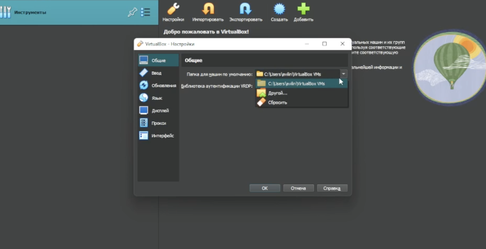
:::

::: {.column width="50%"}
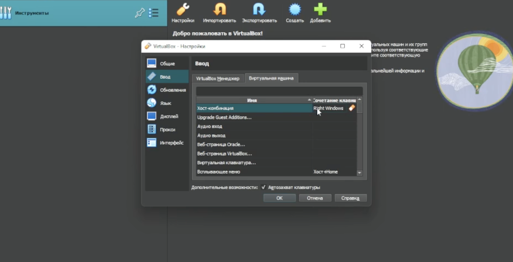
:::

::::::::::::::

## VirtualBox II

:::::::::::::: {.columns align=center}

::: {.column width="50%"}
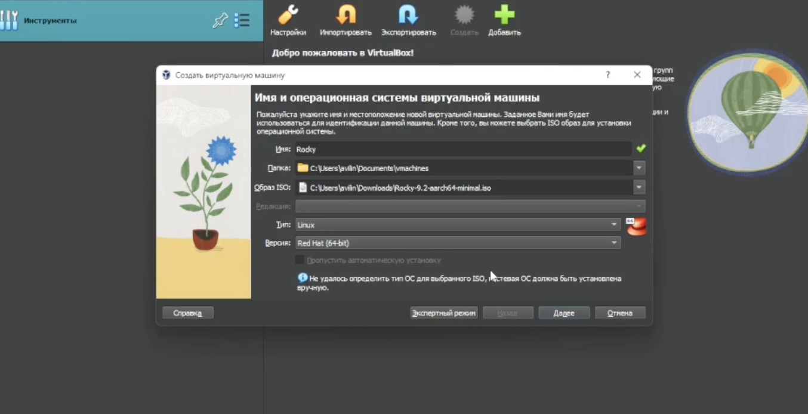
:::

::: {.column width="50%"}
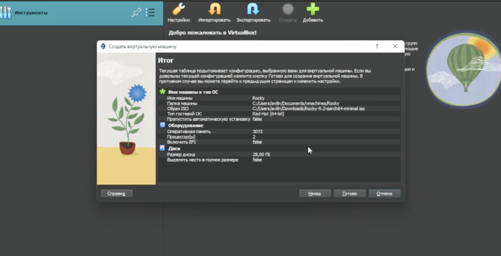
:::

::::::::::::::

## Install Rocky

:::::::::::::: {.columns align=center}

::: {.column width="50%"}
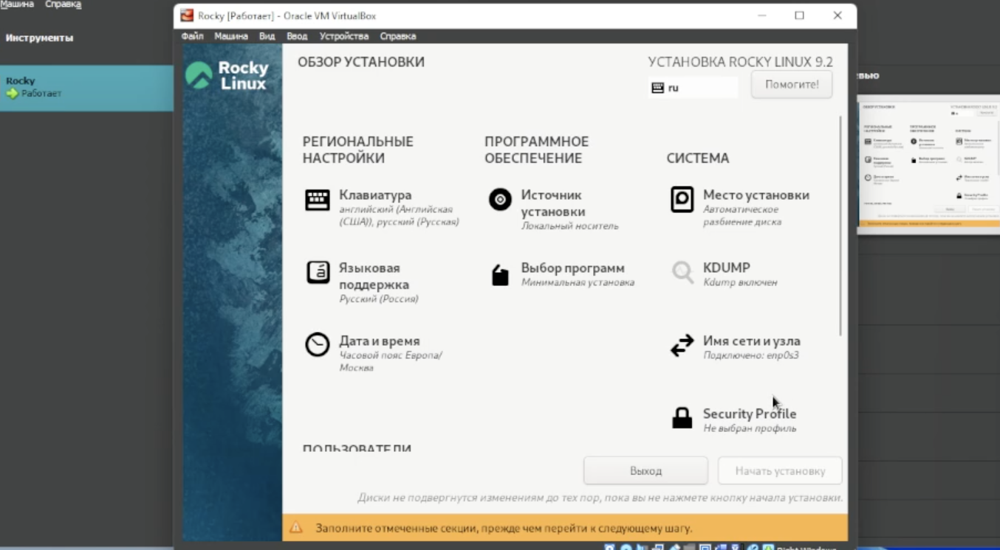
:::

::: {.column width="50%"}
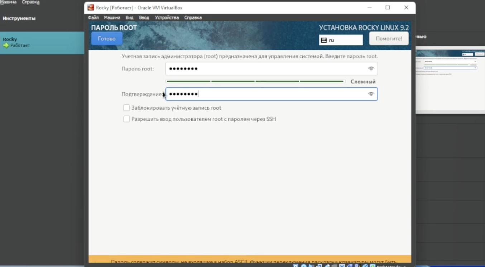
:::

::::::::::::::

## Rocky User

:::::::::::::: {.columns align=center}

::: {.column width="50%"}
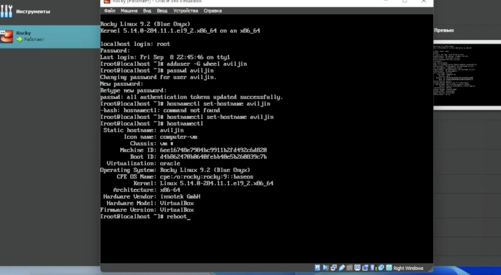
:::

::: {.column width="50%"}
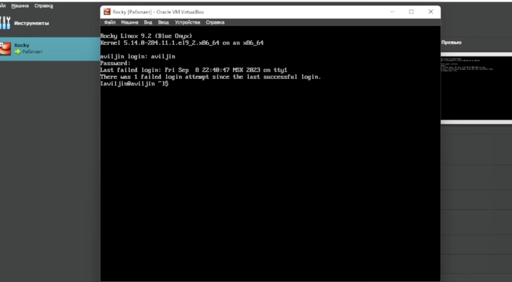
:::

::::::::::::::

## dmesg

:::::::::::::: {.columns align=center}

::: {.column width="50%"}

:::

::: {.column width="50%"}
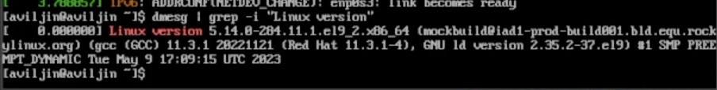
:::

::::::::::::::

## GIT

:::::::::::::: {.columns align=center}

::: {.column width="50%"}
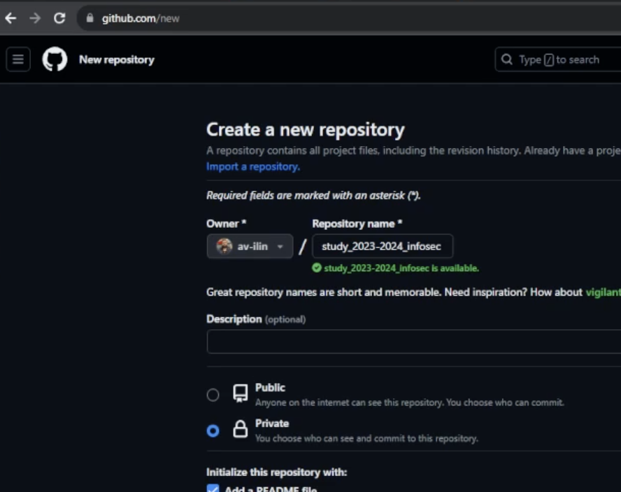
:::

::: {.column width="50%"}
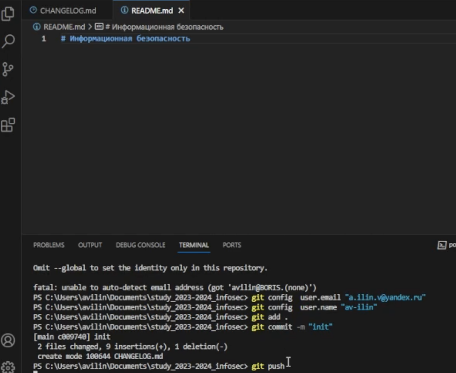
:::

::::::::::::::

# Результаты

## Итог

Создана виртуальная машина с Rocky Linux (minimal), создан хост в соответствии с соглашением об именованиии. На локальную машину установлен VS Code, в котором будет происходить написание отчетов. Также был создан репозиторий git, который был приведен к необходимому начальному состоянию.

## {.standout}

Спасибо за внимание!
