---
## Front matter
title: "Лабораторная работа №1"
subtitle: "Настройка рабочего окружения"
author: "Ильин Андрей Владимирович"

## Generic otions
lang: ru-RU
toc-title: "Содержание"

## Bibliography
bibliography: bib/cite.bib
csl: pandoc/csl/gost-r-7-0-5-2008-numeric.csl

## Pdf output format
toc: true # Table of contents
toc-depth: 2
lof: true # List of figures
lot: false # List of tables
fontsize: 12pt
linestretch: 1.5
papersize: a4
documentclass: scrreprt
## I18n polyglossia
polyglossia-lang:
  name: russian
  options:
	- spelling=modern
	- babelshorthands=true
polyglossia-otherlangs:
  name: english
## I18n babel
babel-lang: russian
babel-otherlangs: english
## Fonts
mainfont: PT Serif
romanfont: PT Serif
sansfont: PT Sans
monofont: PT Mono
mainfontoptions: Ligatures=TeX
romanfontoptions: Ligatures=TeX
sansfontoptions: Ligatures=TeX,Scale=MatchLowercase
monofontoptions: Scale=MatchLowercase,Scale=0.9
## Biblatex
biblatex: true
biblio-style: "gost-numeric"
biblatexoptions:
  - parentracker=true
  - backend=biber
  - hyperref=auto
  - language=auto
  - autolang=other*
  - citestyle=gost-numeric
## Pandoc-crossref LaTeX customization
figureTitle: "Рис."
tableTitle: "Таблица"
listingTitle: "Листинг"
lofTitle: "Список иллюстраций"
lotTitle: "Список таблиц"
lolTitle: "Листинги"
## Misc options
indent: true
header-includes:
  - \usepackage{indentfirst}
  - \usepackage{float} # keep figures where there are in the text
  - \floatplacement{figure}{H} # keep figures where there are in the text
---

# Цель работы

Настроить окружение для выполнения лабоораторных работ по дисциплине Информационная безопасность.

# Задачи

1. Установить дистрибутив Linux на базе RedHat: установить операционную систему Rocky на виртуальную машину, используя средства VirtualBox.

2. Настроить систему контроля версий - Git: создать репозиторий дисциплины, связать с локальной машиной, проинициализировать начальными значениями (добавить changelog, readme, gitignore, license).

# Теоретическое введение

## Термины

- Репозиторий (от англ. repository — хранилище) — место, где хранятся и поддерживаются какие-либо данные. Чаще всего данные в репозитории хранятся в виде файлов, доступных для дальнейшего распространения по сети. [@wiki-repo]

- Контроль версий - это способ сохранять изменения с течением времени, не перезаписывая предыдущие версии. [@git-guides]

- Распределенное ПО для контроля версий - каждый разработчик, работающий с репозиторием, имеет копию всего этого репозитория. [@git-guides]

## Окружение

- Rocky Linux - это корпоративная операционная система с открытым исходным кодом, разработанная таким образом, чтобы быть на 100% совместимой с Red Hat Enterprise Linux. Он находится в стадии интенсивной разработки сообществом. [@rocky-docs]

- Git - это распределенное программное обеспечение для контроля версиями. [@git-guides]

- VirtualBox - это кросс-платформенное ПО для виртуализации x86 и AMD64/Intel64 с открытым кодом для корпоративного и домашнего использования. [@vbox]

# Выполнение лабораторной работы

1. Произведем базовую настройку VirtualBox: установим папку для виртуальных машин и изменим хост-клавишу. (рис. @fig:001, @fig:002)

{#fig:001 width=86%}

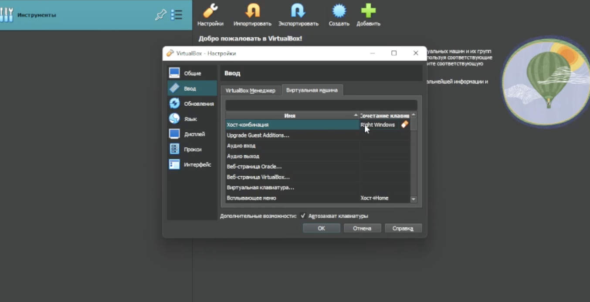{#fig:002 width=86%}

2. Создадим и настроим виртуальную машину, не забываем указать образ диска, с которого будет происходить установка. (рис. @fig:003, @fig:004)

{#fig:003 width=86%}

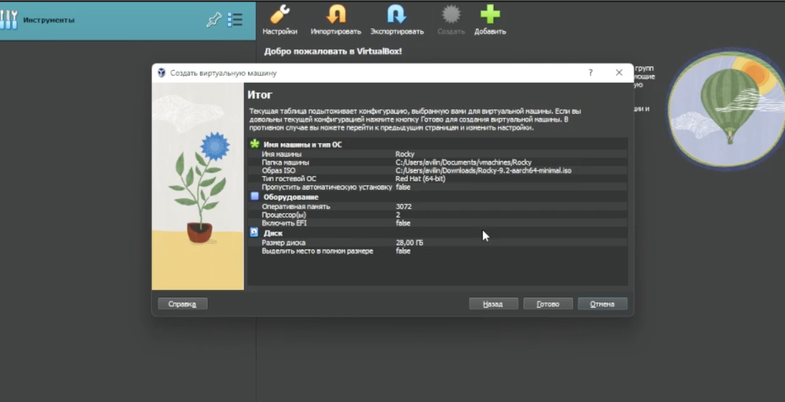{#fig:004 width=86%}

3. Запустим виритульную машину, указываем парметры установки Rocky Linux, обязательно указываем пароль для пользователя root. (рис. @fig:005, @fig:006, @fig:007, @fig:008)

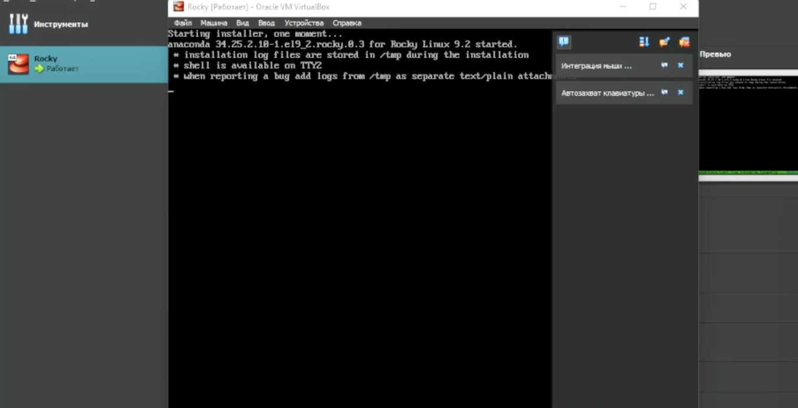{#fig:005 width=86%}

{#fig:006 width=86%}

{#fig:007 width=86%}

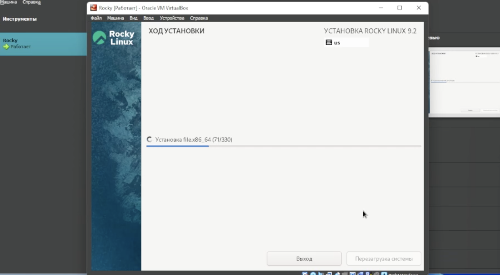{#fig:008 width=86%}

4. После установки, произойдет перезагрузка и запуститься Rocky. В Rocky Linux (minimal) отсутствует GUI. В рамках данной лабораторной работы интерфейс не нужен. Войдем в root пользователя (рис. @fig:009)

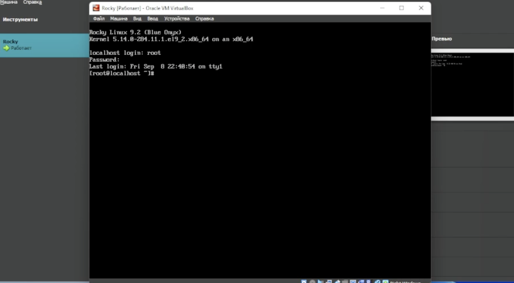{#fig:009 width=86%}

5. Настроим локалхост и имя пользователя, в соответствии соглашения об именовании. (рис. @fig:010, @fig:011)

```bash
adduser -G wheel aviljin
passwd aviljin
hostnamectl set-hostname aviljin
hostnamectl
reboot
```

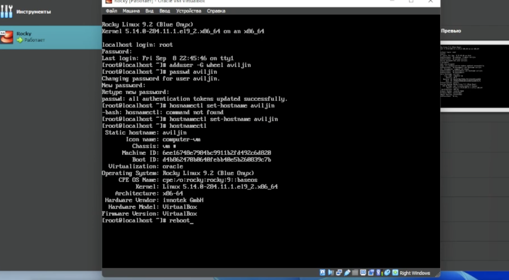{#fig:010 width=86%}

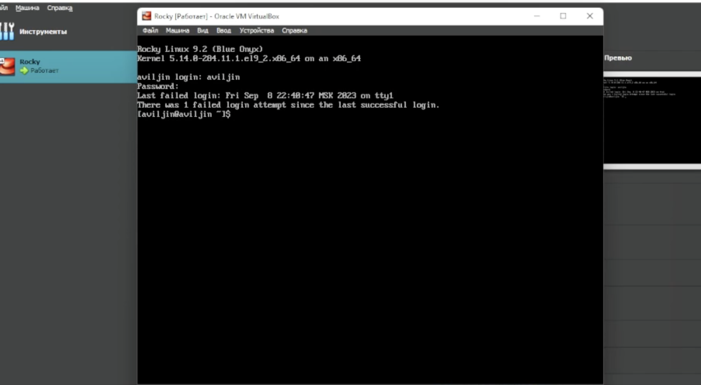{#fig:011 width=86%}

6. Воспользуемся командой `dmesg` для того чтобы получить информацию об установленной системе. (рис. @fig:012, @fig:013, @fig:014, @fig:015)

```bash
dmesg | grep -i "search"
```

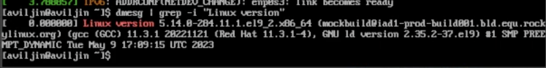{#fig:012 width=86%}

{#fig:013 width=86%}

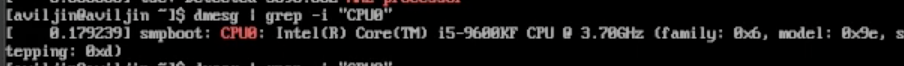{#fig:014 width=86%}

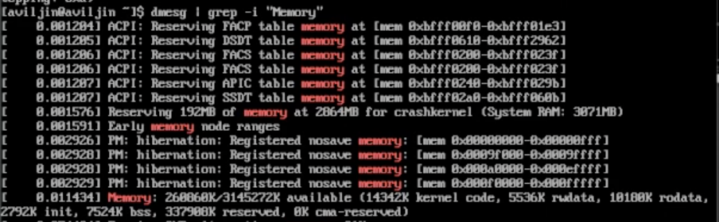{#fig:015 width=86%}

{#fig:016 width=86%}

{#fig:017 width=86%}

{#fig:018 width=86%}

7. Произведем настройку git. Используя GitHub создадим репозиторий, не забывая указать ему лицензию.(рис. @fig:019, @fig:020, @fig:021, @fig:022)

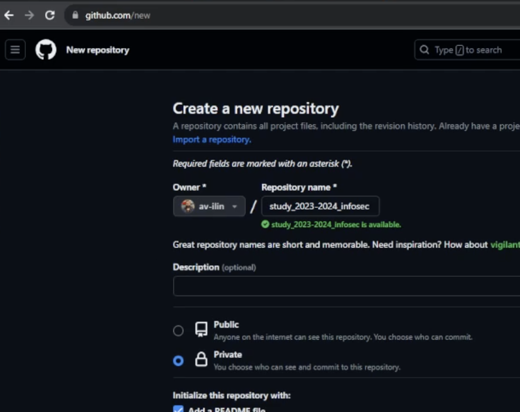{#fig:019 width=86%}

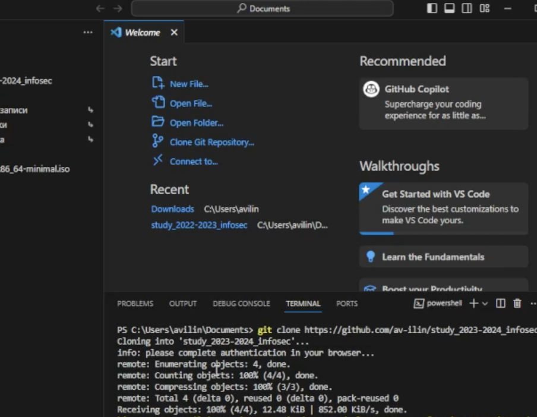{#fig:020 width=86%}

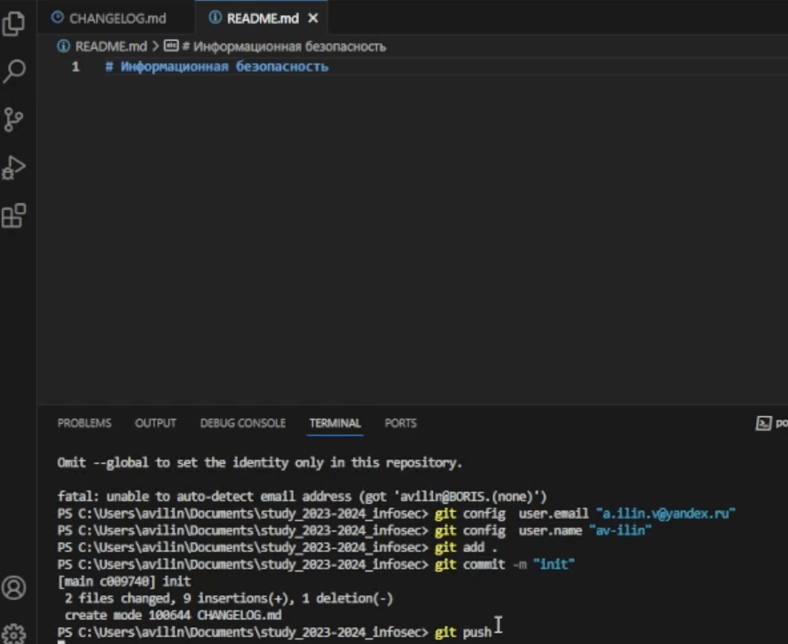{#fig:021 width=86%}

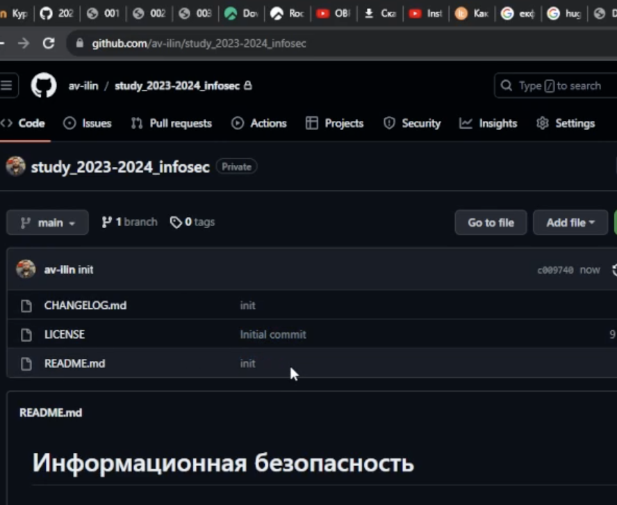{#fig:022 width=86%}

# Анализ результатов

Работа выполненна без непредвиденных проблем в соответствии с руководством. Ошибок и сбоев не произошло. Rocky Linux (minimal) - отлично себя показал, крайне быстро запускается (перезапускается) и выполняет команды, блягодаря отсутствию GUI. Терминала было достаточно для выполнения заданий текущей лабораторной работы (возможно, будет достаточно и для последующих). В случае необходимости можно установить Rocky Server with GUI при помощи ввода минимального кол-ва команд.

```bash
dnf group list
dnf groupinstall "Server with GUI" -y
systemctl set-default graphical
reboot
```

# Выводы

Создана виртуальная машина с Rocky Linux (minimal), создан хост в соответствии с соглашением об именованиии. На локальную машину установлен VS Code, в котором будет происходить написание отчетов. Также был создан репозиторий git, который был приведен к необходимому начальному состоянию.

# Список литературы{.unnumbered}

::: {#refs}
:::
