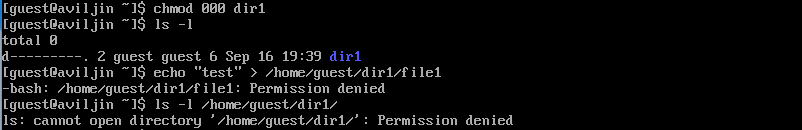

---
## Front matter
lang: ru-RU
title: Лабораторная работа №2
subtitle: Дискреционное разграничение прав в Linux. Основные атрибуты
author:
  - Ильин А.В.
institute:
  - Российский университет дружбы народов, Москва, Россия
date: 16 сентября 2023

## i18n babel
babel-lang: russian
babel-otherlangs: english

## Fonts
mainfont: PT Serif
romanfont: PT Serif
sansfont: PT Sans
monofont: PT Mono
mainfontoptions: Ligatures=TeX
romanfontoptions: Ligatures=TeX
sansfontoptions: Ligatures=TeX,Scale=MatchLowercase
monofontoptions: Scale=MatchLowercase,Scale=0.9

## Formatting pdf
toc: false
toc-title: Содержание
slide_level: 2
aspectratio: 169
section-titles: true
theme: metropolis
header-includes:
  - \metroset{progressbar=frametitle,sectionpage=progressbar,numbering=fraction}
  - '\makeatletter'
  - '\beamer@ignorenonframefalse'
  - '\makeatother'
---

# Информация

## Докладчик

:::::::::::::: {.columns align=center}
::: {.column width="70%"}

- Ильин Андрей Владимирович
- НФИбд-01-20
- 1032201656
- Российский Университет Дружбы Народов
- [1032201656@pfur.ru](mailto:1032201656@pfur.ru)
- <https://github.com/av-ilin>

:::
::: {.column width="30%"}

:::
::::::::::::::

# Вводная часть

## Актуальность

- Приобрести необхдимые в современном научном сообществе навыки администрирования систем и информационной безопасности.

## Цель

- Получение практических навыков работы в консоли с атрибутами файлов, закрепление теоретических основ дискреционного разграничения доступа в современных системах с открытым кодом на базе ОС Linux.

## Задачи

1. Создать, настроить пользователя guest и изучить информацию о пользователе.

2. Создать и изучить дериктории, провести эксперименты с правами доступа.

3. Заполнить таблицы "Установленные права и разрешённые действия" и "Минимальные права для совершения операций".

## Материалы и методы

- Rocky Linux
- Git
- VirtualBox

# Выполнение работы

## Пользователь guest

## Изучение пользователя

## Проверка директории

## Права доступа

## Установленные права и разрешённые действия

## Минимальные права для совершения операцийя

# Результаты

## Итог

В рамках лабораторной работы был создан новый пользовтель guest. На примере данного пользователя мы разобрали базовые команды, изучили информацию о пользователе. Также подробно разобрали права доступа.

## {.standout}

Спасибо за внимание!
