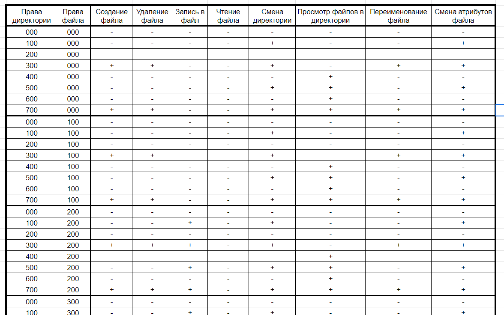

---
## Front matter
title: "Лабораторная работа №2"
subtitle: "Дискреционное разграничение прав в Linux. Основные атрибуты"
author: "Ильин Андрей Владимирович"

## Generic otions
lang: ru-RU
toc-title: "Содержание"

## Bibliography
bibliography: bib/cite.bib
csl: pandoc/csl/gost-r-7-0-5-2008-numeric.csl

## Pdf output format
toc: true # Table of contents
toc-depth: 2
lof: true # List of figures
lot: false # List of tables
fontsize: 12pt
linestretch: 1.5
papersize: a4
documentclass: scrreprt
## I18n polyglossia
polyglossia-lang:
  name: russian
  options:
	- spelling=modern
	- babelshorthands=true
polyglossia-otherlangs:
  name: english
## I18n babel
babel-lang: russian
babel-otherlangs: english
## Fonts
mainfont: PT Serif
romanfont: PT Serif
sansfont: PT Sans
monofont: PT Mono
mainfontoptions: Ligatures=TeX
romanfontoptions: Ligatures=TeX
sansfontoptions: Ligatures=TeX,Scale=MatchLowercase
monofontoptions: Scale=MatchLowercase,Scale=0.9
## Biblatex
biblatex: true
biblio-style: "gost-numeric"
biblatexoptions:
  - parentracker=true
  - backend=biber
  - hyperref=auto
  - language=auto
  - autolang=other*
  - citestyle=gost-numeric
## Pandoc-crossref LaTeX customization
figureTitle: "Рис."
tableTitle: "Таблица"
listingTitle: "Листинг"
lofTitle: "Список иллюстраций"
lotTitle: "Список таблиц"
lolTitle: "Листинги"
## Misc options
indent: true
header-includes:
  - \usepackage{indentfirst}
  - \usepackage{float} # keep figures where there are in the text
  - \floatplacement{figure}{H} # keep figures where there are in the text
---

# Цель работы

Получение практических навыков работы в консоли с атрибутами файлов, закрепление теоретических основ дискреционного разграничения доступа в современных системах с открытым кодом на базе ОС Linux.

# Задачи

1. Создать, настроить пользователя guest и изучить информацию о пользователе.

2. Создать и изучить дериктории, провести эксперименты с правами доступа.

3. Заполнить таблицы "Установленные права и разрешённые действия" и "Минимальные права для совершения операций".

# Теоретическое введение

## Термины

- Терминал (или «Bash», сокращение от «Bourne-Again shell») — это программа, которая используется для взаимодействия с командной оболочкой. Терминал применяется для выполнения административных задач, например: установку пакетов, действия с файлами и управление пользователями. [@terminal]

- Права доступа определяют, какие действия конкретный пользователь может или не может совершать с определенным файлами и каталогами. [@mode]

## Окружение

- Rocky Linux - это корпоративная операционная система с открытым исходным кодом, разработанная таким образом, чтобы быть на 100% совместимой с Red Hat Enterprise Linux. Он находится в стадии интенсивной разработки сообществом. [@rocky-docs]

- Git - это распределенное программное обеспечение для контроля версиями. [@git-guides]

- VirtualBox - это кросс-платформенное ПО для виртуализации x86 и AMD64/Intel64 с открытым кодом для корпоративного и домашнего использования. [@vbox]

# Выполнение лабораторной работы

1. В установленной при выполнении предыдущей лабораторной работы операционной системе создадим учётную запись пользователя `guest`. Зададим пароль для пользователя `guest`, после чего выйдем из текщего пользователя. (рис. @fig:001, @fig:002)

```bash
sudo useradd guest
sudo passwd guest
logout
```

{#fig:001 width=86%}

2. Залогинимся под новым пользователем. Определим директорию, в которой находимся: директория является домашней. Уточним имя пользователя, используя `whoami`. Уточним имя, группу, а также группы, куда входит пользователь, командой `id`. Вспользуемся командой `groups`. Просмотрим файл `/etc/passwd`. (рис. @fig:002)

```bash
pwd
whoami
id
groups
cat /etc/passwd | grep guest
```

{#fig:002 width=86%}

3. Определим существующие в системе директории. Проверим, какие расширенные атрибуты установлены на поддиректориях, находящихся в директории `/home`. Создадим в домашней директории поддиректорию `dir1`, определим командами, какие права доступа и расширенные атрибуты она имеет. (рис. @fig:003)

```bash
ls -l /home/
lsattr /home
mkdir dir1
ls -l
lsattr
```

{#fig:003 width=86%}

4. Cнимем с директории dir1 все атрибуты. Попытаемся создать в директории dir1 файл file1. (рис. @fig:004)

```bash
chmod 000 dir1
ls -l
echo "test" > /home/guest/dir1/file1
ls -l /home/guest/dir1
```

{#fig:004 width=86%}

5. Заполним таблицу «Установленные права и разрешённые действия» [@mygit]. (рис. @fig:005, @fig:006, @fig:007)

{#fig:005 width=86%}

{#fig:006 width=86%}

{#fig:007 width=86%}

6. Заполним таблицу «Минимальные права для совершения операций» [@mygit]. (рис. @fig:008)

{#fig:008 width=86%}

# Анализ результатов

Работа выполненна без непредвиденных проблем в соответствии с руководством. Ошибок и сбоев не произошло.

# Выводы

В рамках лабораторной работы был создан новый пользовтель guest. На примере данного пользователя мы разобрали базовые команды, изучили информацию о пользователе. Также подробно разобрали права доступа.

# Список литературы{.unnumbered}

::: {#refs}
:::
