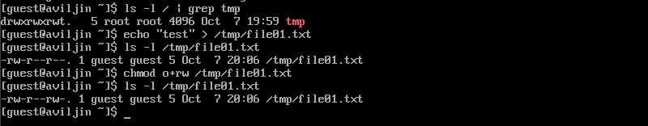

---
## Front matter
title: "Лабораторная работа №5"
subtitle: "Дискреционное разграничение прав в Linux. Исследование влияния дополнительных атрибутов"
author: "Ильин Андрей Владимирович"

## Generic otions
lang: ru-RU
toc-title: "Содержание"

## Bibliography
bibliography: bib/cite.bib
csl: pandoc/csl/gost-r-7-0-5-2008-numeric.csl

## Pdf output format
toc: true # Table of contents
toc-depth: 2
lof: true # List of figures
lot: false # List of tables
fontsize: 12pt
linestretch: 1.5
papersize: a4
documentclass: scrreprt
## I18n polyglossia
polyglossia-lang:
  name: russian
  options:
	- spelling=modern
	- babelshorthands=true
polyglossia-otherlangs:
  name: english
## I18n babel
babel-lang: russian
babel-otherlangs: english
## Fonts
mainfont: PT Serif
romanfont: PT Serif
sansfont: PT Sans
monofont: PT Mono
mainfontoptions: Ligatures=TeX
romanfontoptions: Ligatures=TeX
sansfontoptions: Ligatures=TeX,Scale=MatchLowercase
monofontoptions: Scale=MatchLowercase,Scale=0.9
## Biblatex
biblatex: true
biblio-style: "gost-numeric"
biblatexoptions:
  - parentracker=true
  - backend=biber
  - hyperref=auto
  - language=auto
  - autolang=other*
  - citestyle=gost-numeric
## Pandoc-crossref LaTeX customization
figureTitle: "Рис."
tableTitle: "Таблица"
listingTitle: "Листинг"
lofTitle: "Список иллюстраций"
lotTitle: "Список таблиц"
lolTitle: "Листинги"
## Misc options
indent: true
header-includes:
  - \usepackage{indentfirst}
  - \usepackage{float} # keep figures where there are in the text
  - \floatplacement{figure}{H} # keep figures where there are in the text
---

# Цель работы

Изучение механизмов изменения идентификаторов, применения SetUID- и Sticky-битов. Получение практических навыков работы в консоли с дополнительными атрибутами. Рассмотрение работы механизма смены идентификатора процессов пользователей, а также влияние бита Sticky на запись и удаление файлов.

# Задачи

1. Создать программу способную выводить gid, uid и провести ислледование SetUID-битов.

2. Исследовать Sticky-бит.

# Теоретическое введение

## Термины

- Терминал (или «Bash», сокращение от «Bourne-Again shell») — это программа, которая используется для взаимодействия с командной оболочкой. Терминал применяется для выполнения административных задач, например: установку пакетов, действия с файлами и управление пользователями. [@terminal]

- Права доступа определяют, какие действия конкретный пользователь может или не может совершать с определенным файлами и каталогами. [@mode]

- Расширенные атрибуты файловых объектов (далее - расширенные атрибуты) - поддерживаемая некоторыми файловыми системами возможность ассоциировать с файловыми объектами произвольные метаданные. [@attr]

- Sticky Bit - в случае, если этот бит установлен для папки, то файлы в этой папке могут быть удалены только их владельцем. [@s-bit]

## Окружение

- Rocky Linux - это корпоративная операционная система с открытым исходным кодом, разработанная таким образом, чтобы быть на 100% совместимой с Red Hat Enterprise Linux. Он находится в стадии интенсивной разработки сообществом. [@rocky-docs]

- Git - это распределенное программное обеспечение для контроля версиями. [@git-guides]

- VirtualBox - это кросс-платформенное ПО для виртуализации x86 и AMD64/Intel64 с открытым кодом для корпоративного и домашнего использования. [@vbox]

# Выполнение лабораторной работы

## Создание программы

1. Создадим, скомплилируем и запустим программу `simpleid.c`. Сравним c выводом команды `id`. (рис. @fig:001)

```bash
gcc simpleid.c -o simpleid
./simpleid
id
```

```c
#include <sys/types.h>
#include <unistd.h>
#include <stdio.h>

int main () {
    uid_t uid = geteuid();
    gid_t gid = getegid();
    printf ("uid=%d, gid=%d\n", uid, gid);
    return 0;
}
```

2. Создадим, скомплилируем и запустим программу `simpleid2.c` (усложненная версия `simpleid.c`). (рис. @fig:001)

```bash
gcc simpleid2.c -o simpleid2
./simpleid2
```

```c
#include <sys/types.h>
#include <unistd.h>
#include <stdio.h>

int main () {
    uid_t real_uid = getuid();
    uid_t e_uid = geteuid();
    gid_t real_gid = getgid();
    gid_t e_gid = getegid();
    printf ("e_uid=%d, e_gid=%d\n", e_uid, e_gid);
    printf ("real_uid=%d, real_gid=%d\n", real_uid, real_gid);
    return 0;
}
```

{#fig:001 width=86%}

3. От имени суперпользователя сменим пользователя и изменим аттрибуты на `simpleid2`. Выполним проверку правильности установки новых атрибутов и смены владельца файла `simpleid2`. После чего запустим `simpleid2` (от имени `guest`) (рис. @fig:002)

```bash
su
chown root:guest /home/guest/simpleid2
chmod u+s /home/guest/simpleid2
exit
ls -l simpleid2
./simpleid2
```

4. От имени суперпользователя устаном SetGID-бит на `simpleid2`. Выполним проверку правильности установки новых атрибутов файла `simpleid2`. После чего запустим `simpleid2` (от имени `guest`) (рис. @fig:002)

```bash
su
chmod u-s /home/guest/simpleid2
chmod g+s /home/guest/simpleid2
exit
ls -l simpleid2
./simpleid2
```

{#fig:002 width=86%}

5. Создим программу `readfile.c`. Откомпилируем ее. Сменим владельца у файла `readfile.c` и изменим права так, чтобы только суперпользователь (root) мог прочитать его. Проверим, что пользователь `guest` не может прочитать файл `readfile.c`. После этого сменим у программы `readfile` владельца и установим SetUID-бит. (рис. @fig:003)

```c
#include <fcntl.h>
#include <stdio.h>
#include <sys/stat.h>
#include <sys/types.h>
#include <unistd.h>

int main (int argc, char* argv[]) {
    unsigned char buffer[16];
    size_t bytes_read;
    int i;
    int fd = open (argv[1], O_RDONLY);

    do {
        bytes_read = read(fd, buffer, sizeof (buffer));
        for (i = 0; i < bytes_read; ++i) printf("%c", buffer[i]);
    }

    while (bytes_read == sizeof (buffer));
    close(fd);
    return 0;
}
```

```bash
su
chown root:guest readfile.c
chmod 700 readfile.c
exit
cat readfile.c
su
chown root:guest readfile
chmod u+s readfile
exit
```

{#fig:003 width=86%}

6. Проверим, может ли программа `readfile` прочитать файлы `readfile.c` и `/etc/shadow`. (рис. @fig:004, @fig:005)

```bash
./readfile readfile.c
```

{#fig:004 width=86%}

```bash
./readfile /etc/shadow
```

{#fig:005 width=86%}

## Исследование Sticky-бита

1. Выясним, установлен ли атрибут Sticky на директории `/tmp`. От имени пользователя guest создадим файл `file01.txt` в директории `/tmp` со словом `test`. Просмотрим атрибуты у только что созданного файла и разрешим чтение и запись для категории пользователей «все остальные». (рис. @fig:006)

```bash
ls -l / | grep tmp
echo "test" > /tmp/file01.txt
ls -l /tmp/file01.txt
chmod o+rw /tmp/file01.txt
ls -l /tmp/file01.txt
```

{#fig:006 width=86%}

2. От имени пользователя `guest2` проведем исследование атрибута Sticky. (рис. @fig:007)

```bash
cat /tmp/file01.txt
echo "test2" >> /tmp/file01.txt
cat /tmp/file01.txt
echo "test3" > /tmp/file01.txt
cat /tmp/file01.txt
rm /tmp/fileOl.txt
```

{#fig:007 width=86%}

3. Удалим атрибут Sticky на директории `/tmp` и повторим действия из предыдущего пункта. После вернем атрибут. (рис. @fig:008)

```bash
su -
chmod -t /tmp
cat /tmp/file01.txt
exit
ls -l / | grep tmp

echo "test2" >> /tmp/file01.txt
cat /tmp/file01.txt
echo "test3" > /tmp/file01.txt
cat /tmp/file01.txt
rm /tmp/fileOl.txt

su -
chmod +t /tmp
cat /tmp/file01.txt
exit
ls -l / | grep tmp
```

{#fig:008 width=86%}

# Анализ результатов

Работа выполненна без непредвиденных проблем в соответствии с руководством. Ошибок и сбоев не произошло.

# Выводы

Изучены идентификаторы SetUID-биты и Sticky-биты. Опробовали их действие на практике. Изучили влияние бита Sticky. Повысили свои навыки использования интерфейса командой строки (CLI).

# Список литературы{.unnumbered}

::: {#refs}
:::
