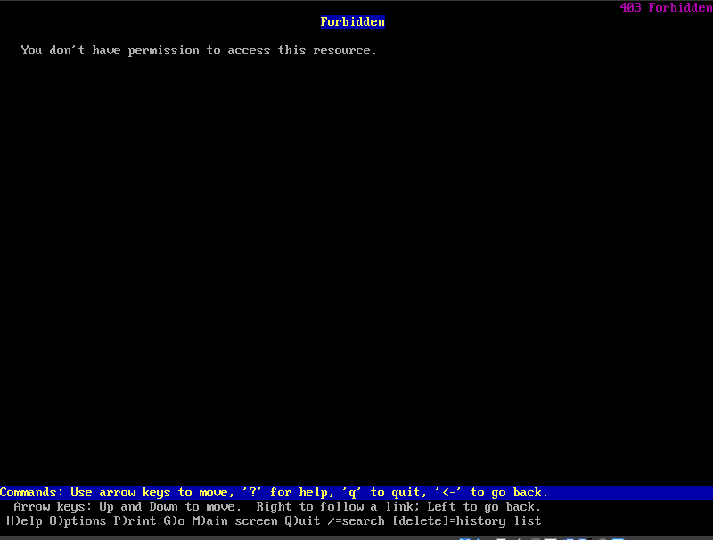
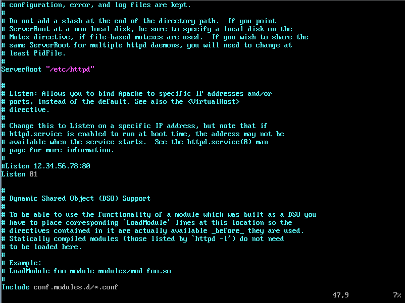
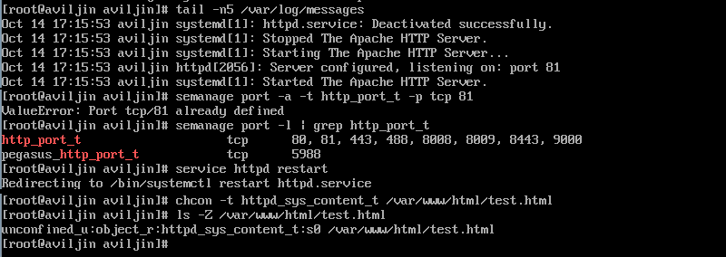

---
## Front matter
lang: ru-RU
title: "Лабораторная работа №6"
subtitle: "Мандатное разграничение прав в Linux"
author:
  - Ильин А.В.
institute:
  - Российский университет дружбы народов, Москва, Россия
date: 14 октября 2023

## i18n babel
babel-lang: russian
babel-otherlangs: english

## Fonts
mainfont: PT Serif
romanfont: PT Serif
sansfont: PT Sans
monofont: PT Mono
mainfontoptions: Ligatures=TeX
romanfontoptions: Ligatures=TeX
sansfontoptions: Ligatures=TeX,Scale=MatchLowercase
monofontoptions: Scale=MatchLowercase,Scale=0.9

## Formatting pdf
toc: false
toc-title: Содержание
slide_level: 2
aspectratio: 169
section-titles: true
theme: metropolis
header-includes:
  - \metroset{progressbar=frametitle,sectionpage=progressbar,numbering=fraction}
  - '\makeatletter'
  - '\beamer@ignorenonframefalse'
  - '\makeatother'
---

# Информация

## Докладчик

:::::::::::::: {.columns align=center}
::: {.column width="70%"}

- Ильин Андрей Владимирович
- НФИбд-01-20
- 1032201656
- Российский Университет Дружбы Народов
- [1032201656@pfur.ru](mailto:1032201656@pfur.ru)
- <https://github.com/av-ilin>

:::
::: {.column width="30%"}

:::
::::::::::::::

# Вводная часть

## Актуальность

- Приобрести необхдимые в современном научном сообществе навыки администрирования систем и информационной безопасности.

## Цель

- Развить навыки администрирования ОС Linux. Получить первое практическое знакомство с технологией SELinux. Проверить работу SELinx на практике совместно с веб-сервером Apache.

## Задачи

1. Настроить и запустить сервер Apache.

2. Исследовать влияние различных параметров на работу сервера.

## Материалы и методы

- Rocky Linux
- Git
- VirtualBox

# Выполнение работы

## Проверка SELinux. Статус веб-сервера

:::::::::::::: {.columns align=center}
::: {.column width="50%"}

:::
::: {.column width="50%"}

:::
::::::::::::::

## Контекст безопасности. Переключатели SELinux

:::::::::::::: {.columns align=center}
::: {.column width="50%"}

:::
::: {.column width="50%"}

:::
::::::::::::::

## Статистика по политике. Тип файлов и поддиректорий Apache

:::::::::::::: {.columns align=center}
::: {.column width="50%"}

:::
::: {.column width="50%"}

:::
::::::::::::::

## Создание html.test

:::::::::::::: {.columns align=center}
::: {.column width="50%"}

:::
::: {.column width="50%"}

:::
::::::::::::::

## Изменение контекст файла test.html

:::::::::::::: {.columns align=center}
::: {.column width="50%"}

:::
::: {.column width="50%"}

:::
::::::::::::::

## Изменение httpd.conf на прослушование ТСР-порта 81

:::::::::::::: {.columns align=center}
::: {.column width="50%"}

:::
::: {.column width="50%"}

:::
::::::::::::::

# Результаты

## Итог

- Нам удалось развить навыки администрирования ОС Linux. Получить первое практическое знакомство с технологией SELinux. Проверить работу SELinx на практике совместно с веб-сервером Apache. Также мы настроили и запустили сервер Apache. Исследовали влияние различных параметров на работу сервера.

## {.standout}

Спасибо за внимание!
