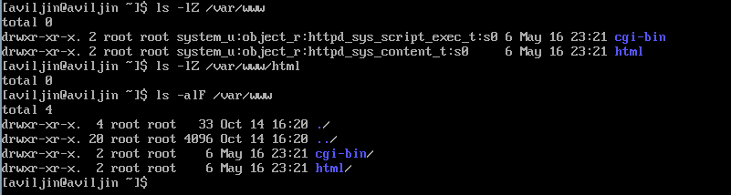
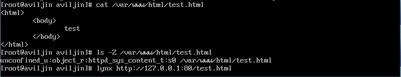
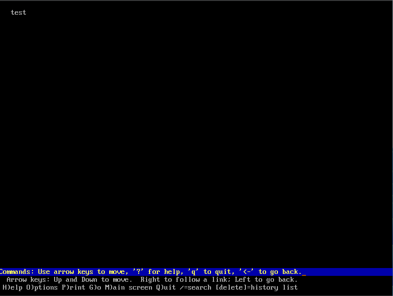

---
## Front matter
lang: ru-RU
title: "Лабораторная работа №5"
subtitle: "Дискреционное разграничение прав в Linux. Исследование влияния дополнительных атрибутов"
author:
  - Ильин А.В.
institute:
  - Российский университет дружбы народов, Москва, Россия
date: 7 октября 2023

## i18n babel
babel-lang: russian
babel-otherlangs: english

## Fonts
mainfont: PT Serif
romanfont: PT Serif
sansfont: PT Sans
monofont: PT Mono
mainfontoptions: Ligatures=TeX
romanfontoptions: Ligatures=TeX
sansfontoptions: Ligatures=TeX,Scale=MatchLowercase
monofontoptions: Scale=MatchLowercase,Scale=0.9

## Formatting pdf
toc: false
toc-title: Содержание
slide_level: 2
aspectratio: 169
section-titles: true
theme: metropolis
header-includes:
  - \metroset{progressbar=frametitle,sectionpage=progressbar,numbering=fraction}
  - '\makeatletter'
  - '\beamer@ignorenonframefalse'
  - '\makeatother'
---

# Информация

## Докладчик

:::::::::::::: {.columns align=center}
::: {.column width="70%"}

- Ильин Андрей Владимирович
- НФИбд-01-20
- 1032201656
- Российский Университет Дружбы Народов
- [1032201656@pfur.ru](mailto:1032201656@pfur.ru)
- <https://github.com/av-ilin>

:::
::: {.column width="30%"}

:::
::::::::::::::

# Вводная часть

## Актуальность

- Приобрести необхдимые в современном научном сообществе навыки администрирования систем и информационной безопасности.

## Цель

- Изучение механизмов изменения идентификаторов, применения SetUID- и Sticky-битов. Получение практических навыков работы в консоли с дополнительными атрибутами. Рассмотрение работы механизма смены идентификатора процессов пользователей, а также влияние бита Sticky на запись и удаление файлов.

## Задачи

1. Создать программу способную выводить gid, uid и провести ислледование SetUID-битов.

2. Исследовать Sticky-бит.

## Материалы и методы

- Rocky Linux
- Git
- VirtualBox

# Выполнение работы

## `simpleid.c` и `simpleid2.c`

:::::::::::::: {.columns align=center}
::: {.column width="70%"}

:::
::::::::::::::

## `simpleid2.c` с измененным владельцем и аттрибутами

:::::::::::::: {.columns align=center}
::: {.column width="70%"}

:::
::::::::::::::

## Подготовка к запуску `readfile`

:::::::::::::: {.columns align=center}
::: {.column width="70%"}

:::
::::::::::::::

## Запуск `readfile`

:::::::::::::: {.columns align=center}
::: {.column width="50%"}

:::
::: {.column width="50%"}

:::
::::::::::::::

## Подготовка к исследованию Sticky-бита

:::::::::::::: {.columns align=center}
::: {.column width="70%"}

:::
::::::::::::::

## Исследование Sticky-бита

:::::::::::::: {.columns align=center}
::: {.column width="50%"}

:::
::: {.column width="50%"}

:::
::::::::::::::

# Результаты

## Итог

- Изучены идентификаторы SetUID-биты и Sticky-биты. Опробовали их действие на практике. Изучили влияние бита Sticky. Повысили свои навыки использования интерфейса командой строки (CLI).

## {.standout}

Спасибо за внимание!
