---
## Front matter
title: "Лабораторная работа №6"
subtitle: "Мандатное разграничение прав в Linux"
author: "Ильин Андрей Владимирович"

## Generic otions
lang: ru-RU
toc-title: "Содержание"

## Bibliography
bibliography: bib/cite.bib
csl: pandoc/csl/gost-r-7-0-5-2008-numeric.csl

## Pdf output format
toc: true # Table of contents
toc-depth: 2
lof: true # List of figures
lot: false # List of tables
fontsize: 12pt
linestretch: 1.5
papersize: a4
documentclass: scrreprt
## I18n polyglossia
polyglossia-lang:
  name: russian
  options:
	- spelling=modern
	- babelshorthands=true
polyglossia-otherlangs:
  name: english
## I18n babel
babel-lang: russian
babel-otherlangs: english
## Fonts
mainfont: PT Serif
romanfont: PT Serif
sansfont: PT Sans
monofont: PT Mono
mainfontoptions: Ligatures=TeX
romanfontoptions: Ligatures=TeX
sansfontoptions: Ligatures=TeX,Scale=MatchLowercase
monofontoptions: Scale=MatchLowercase,Scale=0.9
## Biblatex
biblatex: true
biblio-style: "gost-numeric"
biblatexoptions:
  - parentracker=true
  - backend=biber
  - hyperref=auto
  - language=auto
  - autolang=other*
  - citestyle=gost-numeric
## Pandoc-crossref LaTeX customization
figureTitle: "Рис."
tableTitle: "Таблица"
listingTitle: "Листинг"
lofTitle: "Список иллюстраций"
lotTitle: "Список таблиц"
lolTitle: "Листинги"
## Misc options
indent: true
header-includes:
  - \usepackage{indentfirst}
  - \usepackage{float} # keep figures where there are in the text
  - \floatplacement{figure}{H} # keep figures where there are in the text
---

# Цель работы

Развить навыки администрирования ОС Linux. Получить первое практическое знакомство с технологией SELinux. Проверить работу SELinx на практике совместно с веб-сервером Apache.

# Задачи

1. Настроить и запустить сервер Apache.

2. Исследовать влияние различных параметров на работу сервера.

# Теоретическое введение

## Термины

- Терминал (или «Bash», сокращение от «Bourne-Again shell») — это программа, которая используется для взаимодействия с командной оболочкой. Терминал применяется для выполнения административных задач, например: установку пакетов, действия с файлами и управление пользователями. [@terminal]

- Права доступа определяют, какие действия конкретный пользователь может или не может совершать с определенным файлами и каталогами. [@mode]

- Расширенные атрибуты файловых объектов (далее - расширенные атрибуты) - поддерживаемая некоторыми файловыми системами возможность ассоциировать с файловыми объектами произвольные метаданные. [@attr]

- Security Enhanced Linux (SELinux) – это система контроля доступа, которая в настоящее время встраиватся в большинство Linux-дистрибутивов. [@selinux]

## Окружение

- Rocky Linux - это корпоративная операционная система с открытым исходным кодом, разработанная таким образом, чтобы быть на 100% совместимой с Red Hat Enterprise Linux. Он находится в стадии интенсивной разработки сообществом. [@rocky-docs]

- Git - это распределенное программное обеспечение для контроля версиями. [@git-guides]

- VirtualBox - это кросс-платформенное ПО для виртуализации x86 и AMD64/Intel64 с открытым кодом для корпоративного и домашнего использования. [@vbox]

# Выполнение лабораторной работы

1. Убедимся, что SELinux работает в режиме `enforcing` политики `targeted`. (рис. @fig:001)

```bash
getenforce
sestatus
```

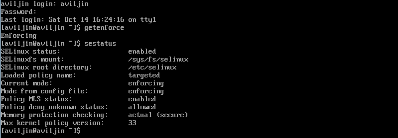{#fig:001 width=86%}

2. Запустим веб-сервер. Убедимся, что он работает. (рис. @fig:002)

```bash
service httpd start
service httpd status
```

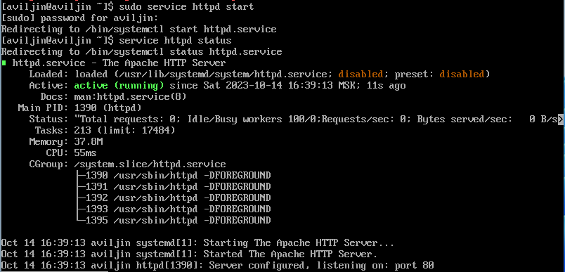{#fig:002 width=86%}

3. Найдем веб-сервер Apache в списке процессов, определим его контекст безопасности. (рис. @fig:003)

```bash
ps auxZ | grep httpd
```

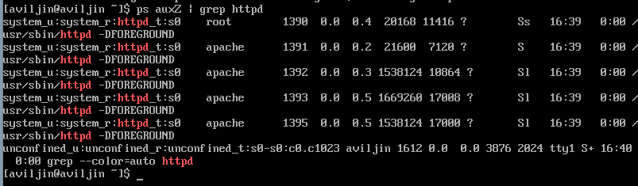{#fig:003 width=86%}

4. Посмотрим текущее состояние переключателей SELinux для Apache. (рис. @fig:004)

```bash
sestatus -b | grep httpd
```

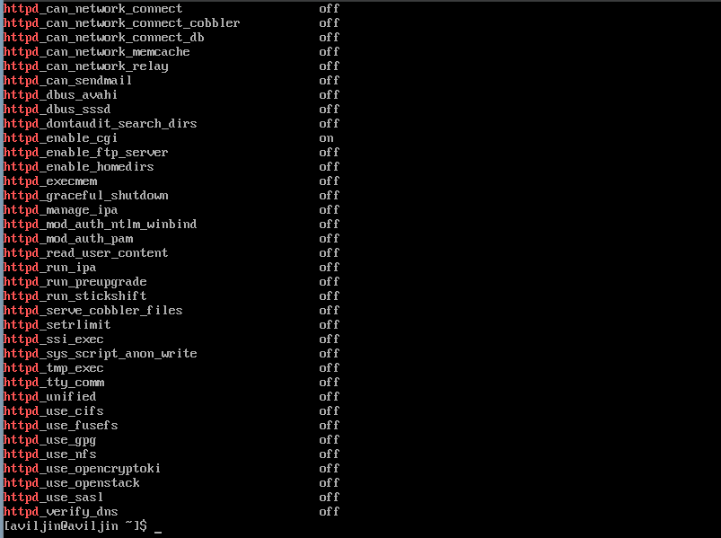{#fig:004 width=86%}

5. Посмотрим статистику по политике. (рис. @fig:005)

```bash
seinfo
```

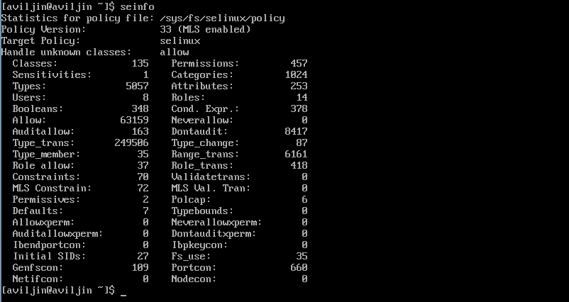{#fig:005 width=86%}

6. Определиv тип файлов и поддиректорий, находящихся в директориях `/var/www`, `/var/www/html`. Определиv круг пользователей, которым разрешено создание файлов в директории `/var/www/html`. (рис. @fig:006)

```bash
ls -lZ /var/www
ls -lZ /var/www/html
ls -alF /var/www
```

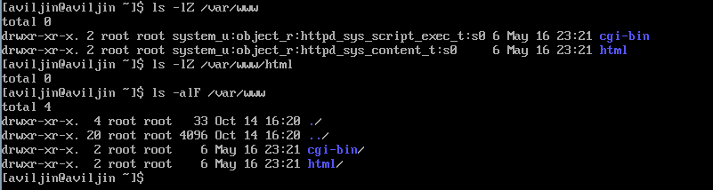{#fig:006 width=86%}

7. Создаlbv от имени суперпользователя html-файл в /var/www/html/test.html. Проверим контекст созданного файла. Обратимся к файлу через веб-сервер. (рис. @fig:007, @fig:008)

```html
<html>
  <body>
    test
  </body>
</html>
```

```bash
touch /var/www/html/test.html
vim /var/www/html/test.html
ls -Z /var/www/html/test.html
lynx http://127.0.0.1/test.html
```

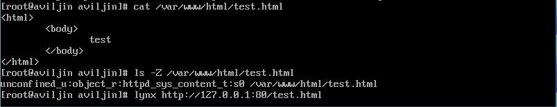{#fig:007 width=86%}

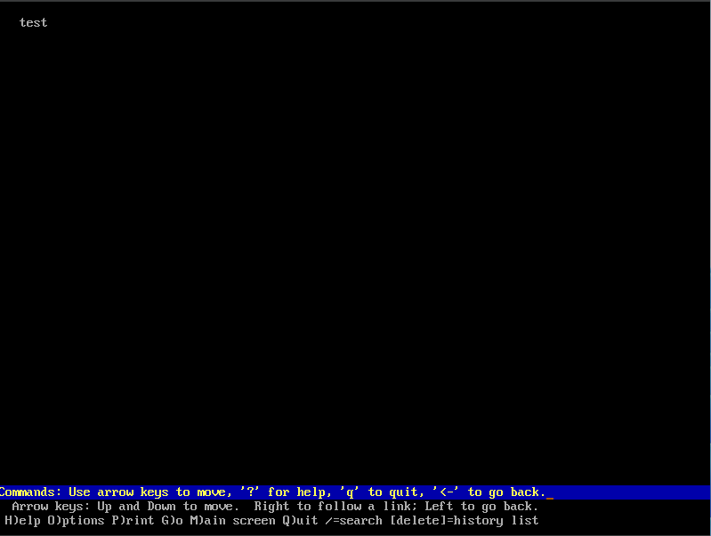{#fig:008 width=86%}

8. Изменим контекст файла `/var/www/html/test.html` с `httpd_sys_content_t` на любой другой, к которому процесс httpd не должен иметь доступа, например, на `samba_share_t`. Попробуем ещё раз получить доступ к файлу через веб-сервер. Просмотрим log-файлы веб-сервера Apache. (рис. @fig:009, @fig:010, @fig:011)

```bash
chcon -t samba_share_t /var/www/html/test.html
ls -Z /var/www/html/test.html
lynx http://127.0.0.1/test.html
tail /var/log/audit/audit.log
```

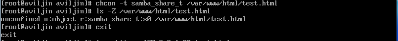{#fig:009 width=86%}

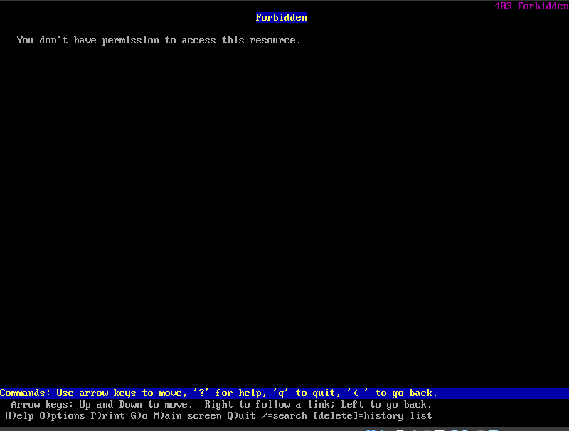{#fig:010 width=86%}

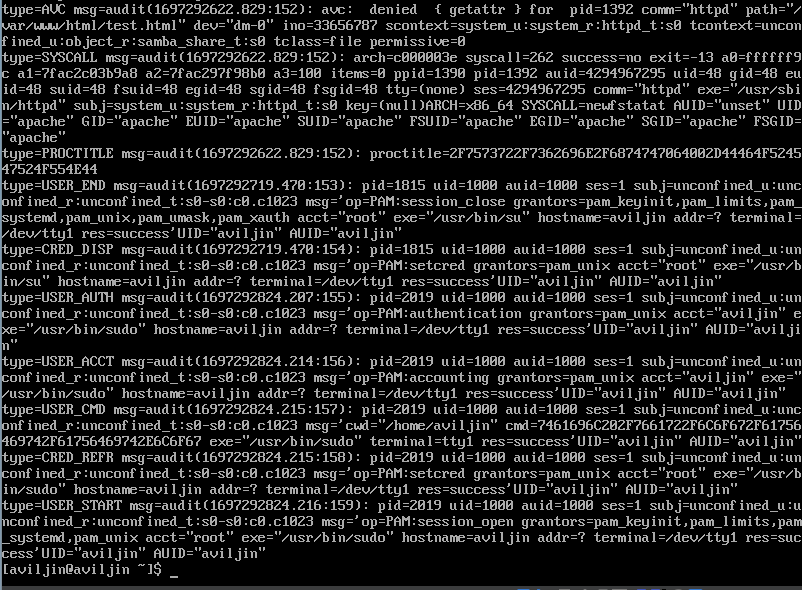{#fig:011 width=86%}

9. Попробуйте запустить веб-сервер Apache на прослушивание ТСР-порта 81. Перезапустим веб-сервер Apache. (рис. @fig:012, @fig:013)

```bash
vim /etc/httpd/conf/httpd.conf
service httpd restart
service httpd status
```

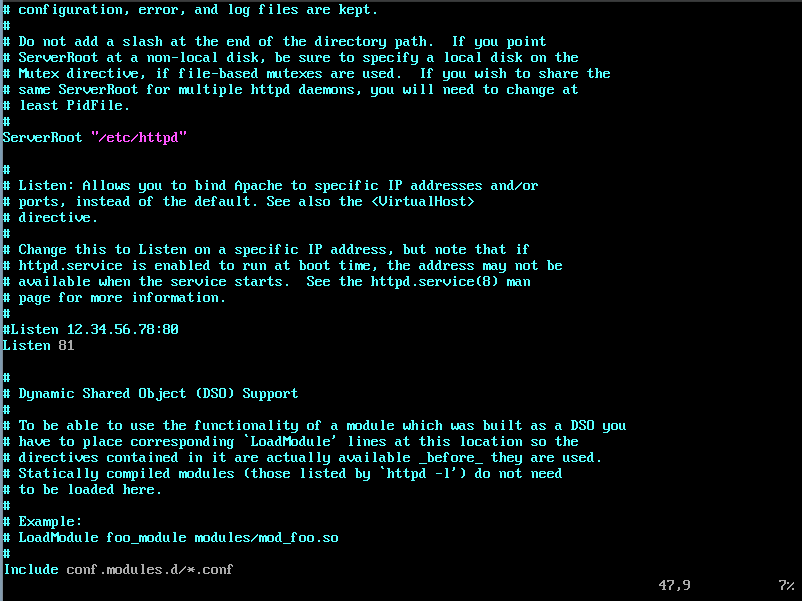{#fig:012 width=86%}

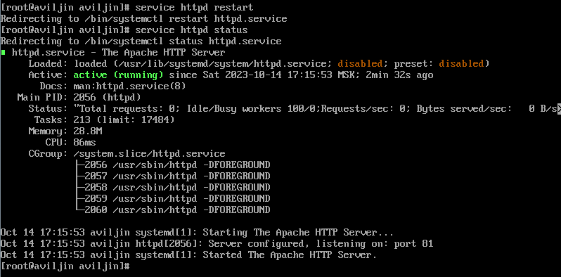{#fig:013 width=86%}

10. Проанализируем лог-файлы. Добавим порт 81 в список портов. (данный порт, как оказалось, уже был в списке, из-за этого не произошло сбоя). Перезапустим сервер. Вернем контекст `httpd_sys_cоntent__t`. Попробуем получить доступ к файлу через веб-сервер (рис. @fig:014, @fig:015)

```bash
tail -n5 /var/log/messages

semanage port -a -t http_port_t -р tcp 81
semanage port -l | grep http_port_t
service httpd restart

chcon -t httpd_sys_content_t /var/www/html/test.html
lynx http://127.0.0.1/test.html
```

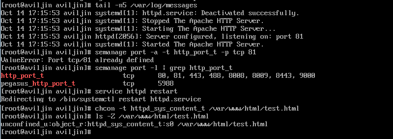{#fig:012 width=86%}

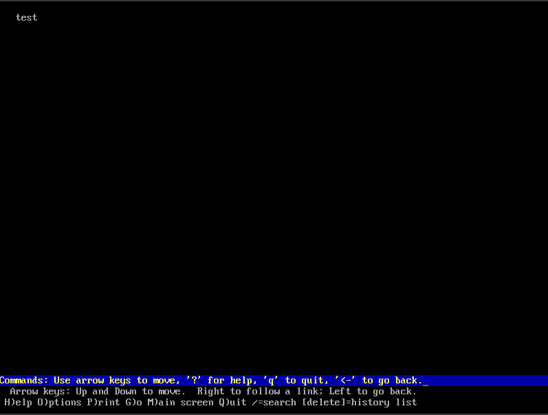{#fig:015 width=86%}

# Анализ результатов

Работа выполненна без непредвиденных проблем в соответствии с руководством. Ошибок и сбоев не произошло.

# Выводы

Нам удалось развить навыки администрирования ОС Linux. Получить первое практическое знакомство с технологией SELinux. Проверить работу SELinx на практике совместно с веб-сервером Apache. Такде мы настроили и запустили сервер Apache. Исследовали влияние различных параметров на работу сервера.

# Список литературы{.unnumbered}

::: {#refs}
:::
