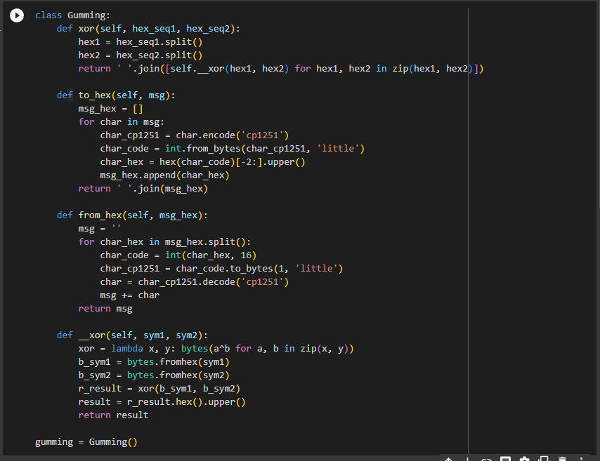
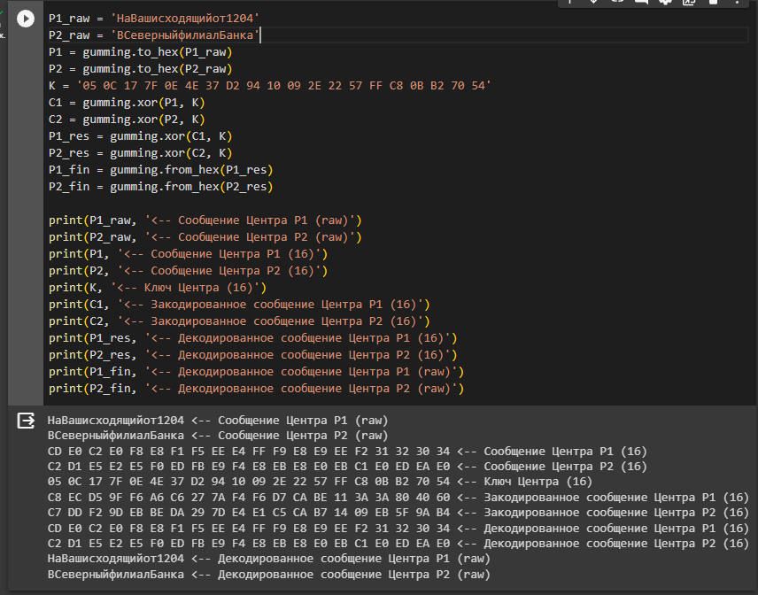
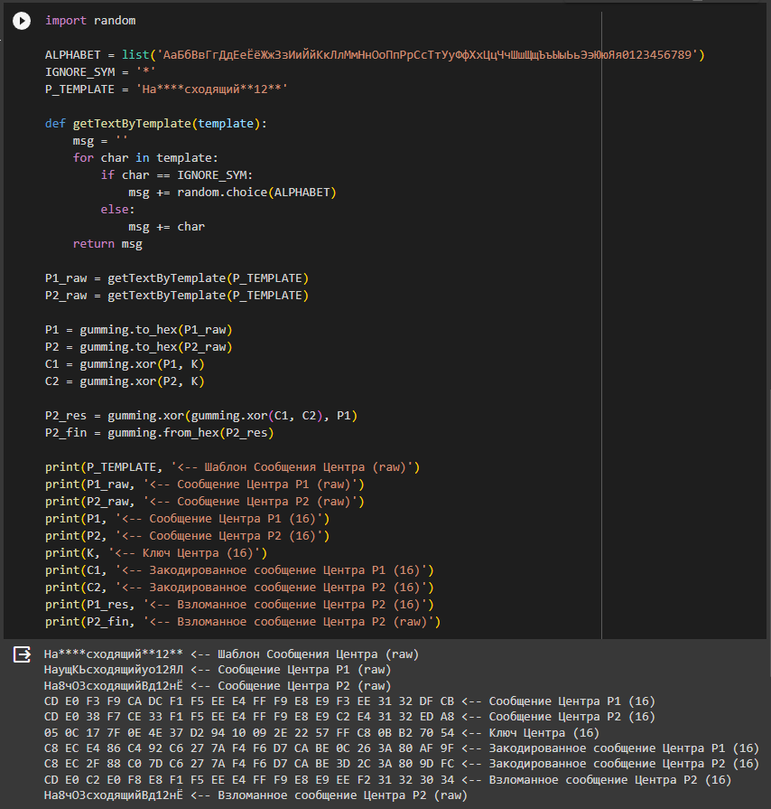

---
## Front matter
lang: ru-RU
title: "Лабораторная работа №8"
subtitle: "Элементы криптографии. Шифрование (кодирование) различных исходных текстов одним ключом"
author:
  - Ильин А.В.
institute:
  - Российский университет дружбы народов, Москва, Россия
date: 28 октября 2023

## i18n babel
babel-lang: russian
babel-otherlangs: english

## Fonts
mainfont: PT Serif
romanfont: PT Serif
sansfont: PT Sans
monofont: PT Mono
mainfontoptions: Ligatures=TeX
romanfontoptions: Ligatures=TeX
sansfontoptions: Ligatures=TeX,Scale=MatchLowercase
monofontoptions: Scale=MatchLowercase,Scale=0.9

## Formatting pdf
toc: false
toc-title: Содержание
slide_level: 2
aspectratio: 169
section-titles: true
theme: metropolis
header-includes:
  - \metroset{progressbar=frametitle,sectionpage=progressbar,numbering=fraction}
  - '\makeatletter'
  - '\beamer@ignorenonframefalse'
  - '\makeatother'
---

# Информация

## Докладчик

:::::::::::::: {.columns align=center}
::: {.column width="70%"}

- Ильин Андрей Владимирович
- НФИбд-01-20
- 1032201656
- Российский Университет Дружбы Народов
- [1032201656@pfur.ru](mailto:1032201656@pfur.ru)
- <https://github.com/av-ilin>

:::
::: {.column width="30%"}

:::
::::::::::::::

# Вводная часть

## Актуальность

- Приобрести необхдимые в современном научном сообществе навыки администрирования систем и информационной безопасности.

## Цель

- Освоить на практике применение режима однократного гаммирования1

## Задачи

Необходимо разработать приложение, позволяющее шифровать и дешифровать тексты $P_1$ и $P_2$ в режиме однократного гаммирования.Приложение должно:

1. Определить вид шифротекстов $C_1$ и $C_2$ обоих текстов $P_1$ и $P_2$ при известном ключе.

2. Требуется не зная ключа и не стремясь его определить, прочитать текст $P_2$, при условии, что текста подчиняются шаблону.

## Материалы и методы

- python
- Google Colab

# Выполнение работы

## Класс Gumming

:::::::::::::: {.columns align=center}
::: {.column width="70%"}

:::
::::::::::::::

## Режим однократного гаммирования

:::::::::::::: {.columns align=center}
::: {.column width="70%"}

:::
::::::::::::::

## Взлом второго текста

:::::::::::::: {.columns align=center}
::: {.column width="70%"}

:::
::::::::::::::

# Результаты

## Итог

- Нам удалось освоить на практике применение режима однократного гаммирования, в дополнение закрпеили навки владения языками программирования, в частности языком программирования - `python`.

## {.standout}

Спасибо за внимание!
