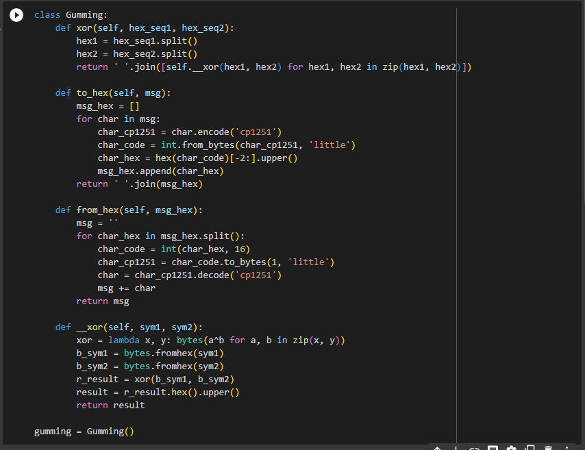
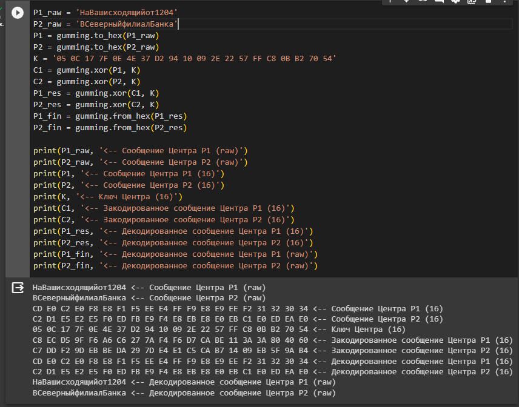
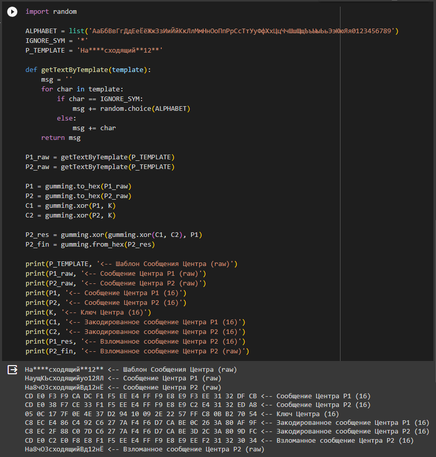

---
## Front matter
title: "Лабораторная работа №8"
subtitle: "Элементы криптографии. Шифрование (кодирование) различных исходных текстов одним ключом"
author: "Ильин Андрей Владимирович"

## Generic otions
lang: ru-RU
toc-title: "Содержание"

## Bibliography
bibliography: bib/cite.bib
csl: pandoc/csl/gost-r-7-0-5-2008-numeric.csl

## Pdf output format
toc: true # Table of contents
toc-depth: 2
lof: true # List of figures
lot: false # List of tables
fontsize: 12pt
linestretch: 1.5
papersize: a4
documentclass: scrreprt
## I18n polyglossia
polyglossia-lang:
  name: russian
  options:
	- spelling=modern
	- babelshorthands=true
polyglossia-otherlangs:
  name: english
## I18n babel
babel-lang: russian
babel-otherlangs: english
## Fonts
mainfont: PT Serif
romanfont: PT Serif
sansfont: PT Sans
monofont: PT Mono
mainfontoptions: Ligatures=TeX
romanfontoptions: Ligatures=TeX
sansfontoptions: Ligatures=TeX,Scale=MatchLowercase
monofontoptions: Scale=MatchLowercase,Scale=0.9
## Biblatex
biblatex: true
biblio-style: "gost-numeric"
biblatexoptions:
  - parentracker=true
  - backend=biber
  - hyperref=auto
  - language=auto
  - autolang=other*
  - citestyle=gost-numeric
## Pandoc-crossref LaTeX customization
figureTitle: "Рис."
tableTitle: "Таблица"
listingTitle: "Листинг"
lofTitle: "Список иллюстраций"
lotTitle: "Список таблиц"
lolTitle: "Листинги"
## Misc options
indent: true
header-includes:
  - \usepackage{indentfirst}
  - \usepackage{float} # keep figures where there are in the text
  - \floatplacement{figure}{H} # keep figures where there are in the text
---

# Цель работы

Освоить на практике применение режима однократного гаммирования на примере кодирования различных исходных текстов одним ключом.

# Задачи

Необходимо разработать приложение, позволяющее шифровать и дешифровать тексты $P_1$ и $P_2$ в режиме однократного гаммирования.Приложение должно:

1. Определить вид шифротекстов $C_1$ и $C_2$ обоих текстов $P_1$ и $P_2$ при известном ключе.

2. Требуется не зная ключа и не стремясь его определить, прочитать текст $P_2$, при условии, что текста подчиняются шаблону.

# Теоретическое введение

Гаммирование представляет собой наложение (снятие) на открытые (зашифрованные) данные последовательности элементов других данных, полученной с помощью некоторого криптографического алгоритма, для получения зашифрованных (открытых) данных. Иными словами, наложение гаммы — это сложение её элементов с элементами открытого (закрытого) текста по некоторому фиксированному модулю, значение которого представляет собой известную часть алгоритма шифрования. [@rudn-task]

В соответствии с теорией криптоанализа, если в методе шифрования используется однократная вероятностная гамма (однократное гаммирование) той же длины, что и подлежащий сокрытию текст, то текст нельзя раскрыть. Даже при раскрытии части последовательности гаммы нельзя получить информацию о всём скрываемом тексте.

Наложение гаммы по сути представляет собой выполнение операции сложения по модулю 2 (XOR).

# Выполнение лабораторной работы

1. Для выполнения лабораторной работы восопользуемся открытым ресурсов Google Colab. Создадим новый ноутбук - в нем будем выполнять лабораторную работу. Возьмем класс Gumming, написанный в предыдущей лабораторной работе. (рис. @fig:001)

```python
class Gumming:
    def xor(self, hex_seq1, hex_seq2):
        hex1 = hex_seq1.split()
        hex2 = hex_seq2.split()
        return ' '.join([self.__xor(hex1, hex2) for hex1, hex2 in zip(hex1, hex2)])

    def to_hex(self, msg):
        msg_hex = []
        for char in msg:
            char_cp1251 = char.encode('cp1251')
            char_code = int.from_bytes(char_cp1251, 'little')
            char_hex = hex(char_code)[-2:].upper()
            msg_hex.append(char_hex)
        return ' '.join(msg_hex)

    def from_hex(self, msg_hex):
        msg = ''
        for char_hex in msg_hex.split():
            char_code = int(char_hex, 16)
            char_cp1251 = char_code.to_bytes(1, 'little')
            char = char_cp1251.decode('cp1251')
            msg += char
        return msg

    def __xor(self, sym1, sym2):
        xor = lambda x, y: bytes(a^b for a, b in zip(x, y))
        b_sym1 = bytes.fromhex(sym1)
        b_sym2 = bytes.fromhex(sym2)
        r_result = xor(b_sym1, b_sym2)
        result = r_result.hex().upper()
        return result

gumming = Gumming()
```

{#fig:001 width=86%}

2. Напишем скрипт, которой будет шифровать и дешифровать тексты $P_1$ и $P_2$ в режиме однократного гаммирования. (рис. @fig:002)

```python
P1_raw = 'НаВашисходящийот1204'
P2_raw = 'ВСеверныйфилиалБанка'
P1 = gumming.to_hex(P1_raw)
P2 = gumming.to_hex(P2_raw)
K = '05 0C 17 7F 0E 4E 37 D2 94 10 09 2E 22 57 FF C8 0B B2 70 54'
C1 = gumming.xor(P1, K)
C2 = gumming.xor(P2, K)
P1_res = gumming.xor(C1, K)
P2_res = gumming.xor(C2, K)
P1_fin = gumming.from_hex(P1_res)
P2_fin = gumming.from_hex(P2_res)
```

{#fig:002 width=86%}

3. Предположим, что каждое сообщение имеет шаблон. Сгенерируем по данному шаблону пару случайных сообщений. Зашифруем их и взломаем второе сообщение, используя шифротексты и известное первое сообщение. (рис. @fig:003)

```python
import random

ALPHABET = list('АаБбВвГгДдЕеЁёЖжЗзИиЙйКкЛлМмНнОоПпРрСсТтУуФфХхЦцЧчШшЩщЪъЫыЬьЭэЮюЯя0123456789')
IGNORE_SYM = '*'
P_TEMPLATE = 'На****сходящий**12**'

def getTextByTemplate(template):
    msg = ''
    for char in template:
        if char == IGNORE_SYM:
            msg += random.choice(ALPHABET)
        else:
            msg += char
    return msg

P1_raw = getTextByTemplate(P_TEMPLATE)
P2_raw = getTextByTemplate(P_TEMPLATE)

P1 = gumming.to_hex(P1_raw)
P2 = gumming.to_hex(P2_raw)
C1 = gumming.xor(P1, K)
C2 = gumming.xor(P2, K)

P2_res = gumming.xor(gumming.xor(C1, C2), P1)
P2_fin = gumming.from_hex(P2_res)
```

{#fig:003 width=86%}

# Анализ результатов

Работа выполненна без непредвиденных проблем в соответствии с руководством. Ошибок и сбоев не произошло.

# Выводы

Нам удалось освоить на практике применение режима однократного гаммирования, в дополнение закрпеили навки владения языками программирования, в частности языком программирования - `python`.

# Список литературы{.unnumbered}

::: {#refs}
:::
